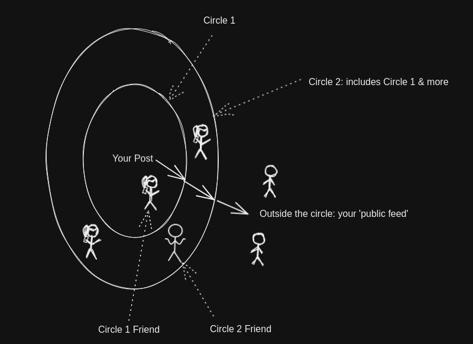

# Slow To Speak

<!-- PROJECT LOGO -->

  

  <h3 align="center">🐢🗣️ Slow To Speak</h3>

  

    A platform for collaborative thought development
     
    <!-- <a href="https://barry-in-his-moms-basement.gitbook.io/slow-to-speak-the-journey/"><strong>Explore the gitbook to learn about the project idea more</strong></a> -->
  

<!-- TABLE OF CONTENTS -->
- [Slow To Speak](#slow-to-speak)
  - [About The Project 📚](#about-the-project-)
  - [The Basic Idea 🌐](#the-basic-idea-)
  - [Core Features 🧰](#core-features-)
  - [What I'm Currently Doing](#what-im-currently-doing)
    - [The Execution Plan](#the-execution-plan)
    - [What I'm Working On](#what-im-working-on)
  - [Contact 👋](#contact-)

<!-- 

  
Table of Contents

  <ol>
    <li><a href="#about-the-project">About The Project</a></li>
    <li><a href="#the-basic-idea">The Basic Idea</a></li>
    <li><a href="#core-features">Core Features</a></li>
    <li><a href="#contact">Contact</a></li>
    <!-- <li><a href="#acknowledgments">Acknowledgments</a></li> -->
  <!-- </ol>

 --> 

## About The Project 📚

This project is intended primarily as a *learning exercise* in how to build and deploy a full-stack web application from scratch. 

Although the bulk of this `README` will try to describe and 'sell' the idea, I'm only doing so to explain what I envision the product to be. I'm not actually trying to sell it to anyone. 

The aim is to build something in order to learn. 

(<a href="#readme-toc">back to TOC</a>)

## The Basic Idea 🌐

>`Slow To Speak` is sort-of what you'd get if you fused [`Twitter`](https://twitter.com/home) and [`Google Docs`](https://www.google.com/docs/about/). 

It's like a social media platform: you've got a private account, you can make posts which only your 'followers' or 'friends' can see. These 'followers' can tell you what they think via 'comments'.

But it's not like a simple fusion between the two in some important ways. 

(<a href="#readme-toc">back to TOC</a>)

<!-- 
## Core Principles 🤔

1. ### Write to think better

Often, written reasoning rewards coherence, clarity, and concision. 

As a result, the process of committing your thinking to text often leaves you with better and clearer ideas.

2. ### Think with others

And if you've written out your ideas, why not share it with others to get even more input?

But, you may not want to immediately put your ideas on the net for anyone to view. Perhaps you'd want to   -->

<!-- But, whether or not this actually results in better thinking is a function of *who* you end up sharing it with.

#### Out In The Wild

If you write a post on a platform like [Medium](https://medium.com/about?autoplay=1), it goes onto a public feed that is theoretically visible to anyone on the net.

That can be great, but perhaps you'd like to work  -->

## Core Features 🧰

There are two **features** that make `Slow To Speak` different from conventional social media/blogging platforms.

1. ### Your followers can be organised into post-specific pipelines.

This feature makes `Slow To Speak` like `Google Docs`.

**For each post**, you can organise your followers into a pipeline that is structured like a bunch of **concentric circles**. 

<figure>
  

</figure>

This isn't quite like `Instagram`'s 'close friends' feature. Each pipeline (or set of concentric circles) is *post-specific*. Follower A could be in the first circle for Post X, but in the outer circle for Post Y. You can set up some default circles to pick from for each post, or construct a specific one while you're making that post.

Also, it's up to you whether you want to use a pipeline or not.

1. ### It's optimized for queries, feedback, and discussion

`Slow To Speak` is a platform for *collaborative* thought development. I haven't ironed out the details of the queries yet, but I'm hoping to make it easy for users to ask and answer queries like:

- What has `Person A` and `Person B` said about my posts regarding `topic_x`?
- How many posts have I published in the past few weeks? 
- How many drafts do I have at the moment?
- Who are my top contributors? Who contributes the least frequently?
- For `topic_y`, do more of my followers hold `Position A` or `Position B`?

Also, like many other social media platforms, you can DM people, create chat/discussion groups with people, find other users you didn't know before to collaborate with, and so on...

(<a href="#readme-toc">back to TOC</a>)

## What I'm Currently Doing 

I will use this space to provide an update on my progress, as well as link to smaller projects I build as I learn the stack/prototype ideas.

### The Execution Plan

The first step is to **build the MVP**.

There are a number of features that I hope to implement which will make `STS` different from just 'Twitter' plus 'Google Docs', but I think the *core* feature to work on first is the configurable post-specific **pipeline** users can push posts through.

So, the MVP is roughly something like: `Twitter` but with an optional pipeline.

### What I'm Working On

The first step is to build this MVP. I'm following something like this:
* [ ] Learn the stack.
  * Or, at least most of it. I know I'm going to use `React.js` and `Typescript`.
  * I am unsure whether or not I'll use `next.js`. And I haven't confirmed how I'll handle the back-end.
  * However, the plan will be to learn some stack that involves `React.js` and `Typescript` to the point that I can do the next step 
* [ ] Learn how to build something like Twitter
  * At least in terms of its core components. 
* [ ] Consider what I might need to tweek to add the pipeline feature
  * At this point, I might need to consider whether or not I'll go with the stack I used in the previous step, or need to pick something else up.

(<a href="#readme-toc">back to TOC</a>)

<!-- TODO : will add deliverables here as they are actually constructed. -->

<!-- ## Why All The Writing?

Here's why:

[This guy](https://www.joelonsoftware.com/2000/10/02/painless-functional-specifications-part-1-why-bother/) and [this guy](https://www.youtube.com/watch?v=M0AHyWCB2O4) convinced me that taking time to write a spec is really worth while.

While developers can't replace programs with prose, writing can you:
* clarify, refine and express your own ideas, which helps you
* communicate your intentions to others better, which could help you
* communicate with your team better, especially when you work in a big team

I'm also hoping these writings will form a narrative that can help others who want to embark on a similar journey.  -->

## Contact 👋

If you'd like to chat about the project more or give some suggestions, reach out via
* [Twitter](https://twitter.com/barrtholemew) or
* Email: ci.barry.quek@gmail.com  

I'd love to hear from you! : )

(<a href="#readme-toc">back to TOC</a>)

<!-- ## Acknowledgements 💯

* The name of the project comes from a verse in the Bible: James 1:19. 

> My dear brothers and sisters, take note of this: Everyone should be quick to listen, **slow to speak** and slow to become angry, because human anger does not produce the righteousness that God desires.

In context, the verse is not about making thoughtful posts. But I got the name from this verse anyway 🤷‍♂️. 

* My many intelligent friends and family whom I am talking to about the idea in both its technical and non-technical aspects.

(<a href="#readme-top">back to top</a>)
 -->
