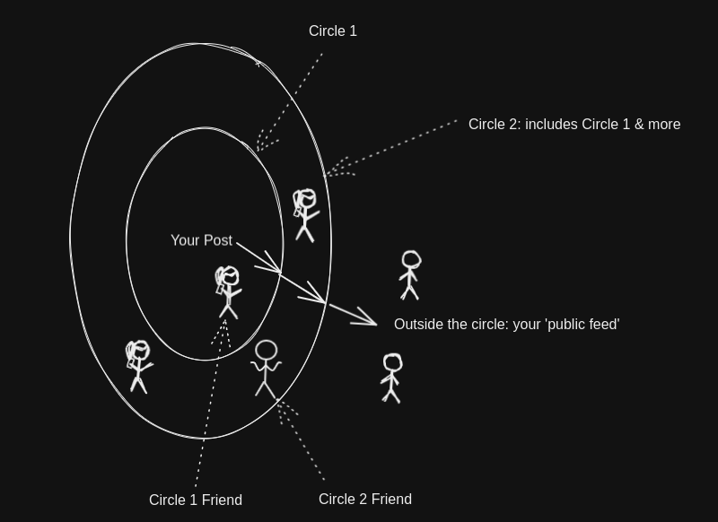

# Overview

> `Slow To Speak` is a service for users to develop and publish their ideas *through* inner circles.

Woah, there's a lot going on there. And what happened to the phrase 'collaborative thought development'? 

There are two main ideas. Users:
* 'develop and publish their ideas'
* '*through* inner circles'

### The Core Idea

Let's look at a picture:

<figure>
  

  <figcaption>
    You can choose for posts to become increasingly visible.
  </figcaption>
</figure>

Think of it as something like a social media platform.

You have a private account. You can make posts which only your 'followers' or 'friends' can see. These 'followers' can tell you what they think via 'comments'. 

It's like that on `Slow To Speak` (**STS** from here on), but with some differences.

**For each post**, you can organise your followers into a pipeline that is structured like a bunch of **concentric circles**. The idea is that you can progressively develop your post as you receive input from various parties. You can eventually publish it after being *pushing it through* each circle, starting with an 'inner-most' circle.

This isn't quite like `Instagram`'s 'close friends' feature. Each pipeline (or set of concentric circles) is *post-specific*. Follower A could be in the first circle for Post X, but in the outer circle for Post Y. You can set up some default circles to pick from for each post, or construct a specific one while you're making that post.

### Toy Example

Let's say you have just 2 followers, Alice and Bob. You are about to make a post that's entitled, `Hot Take`. However, you'd like some input from your friends, so you opt to push it through a pipeline. Stage 1 (or inner circle 1) includes Alice, and Stage 2 (inner circle 2) includes Bob *and Alice* (i.e., Alice can still see the post). 

Your post gets pushed to Stage 1, Alice gets notified, and she comes back with, 'I think your argument commits a logical fallacy at ...'.' Bitter, but rational, you concede that Alice is right and refine your post with more nuance. Alice then comments that she thinks your point is interesting now that it's been refined. Elated, you push it to Stage 2, and Bob gets notified. Bob thinks it's great too, and you decide to push it outside the inner circles into the wild; it's now visible on as a public post.

Next time, you could have Bob view a post before Alice.

### Collaborative Thought Development

The example is contrived, but hopefully it illustrates the idea.

Your `Hot Take` was *developed* and eventually *published through* inner circles of your followers. 

In other words, your followers *collaborated* with you to *develop* your *thoughts*.

