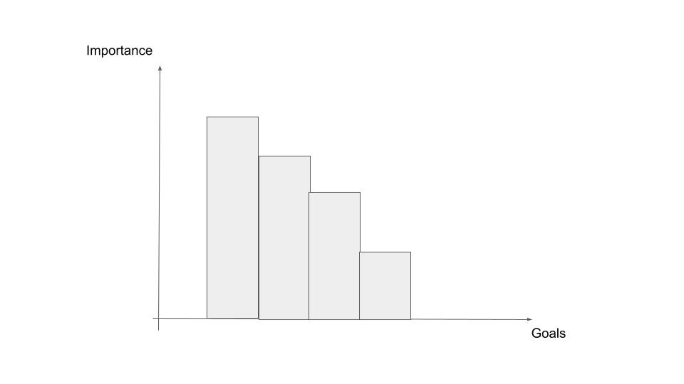
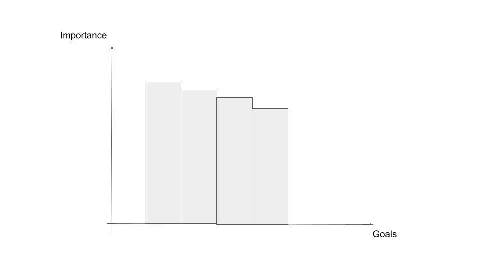

## Clarifying Aims

I actually have some potentially competing aims, and I need to weight each of them relative to one another.

In order of *descending priority*:
1. Learn a range of full-stack development tools
2. Learn the range of core full-stack development concepts
3. Develop a product with the best tools for actual use
4. Develop a product for the market

There's an aim behind Goals 1 and 2: **increase job market competitiveness**.

And there's another aim behind Goals 3 and 4: **develop a product for me, my homies, and more** .

Goals 1 and 2 can be in tension with goals 3 and 4. Notice that the higher-order aim behind goals 1 and 2 (gimme job) bring in another consideration for my plan: *what skills are in vogue for the job market?*

So, for example, it might be that `Angular` or `Svelte` is a much better framework for my particular app. However, `React` is just...[so popular](https://stackdiary.com/front-end-frameworks/#:~:text=The%20Most%20Popular%20Front-end%20Frameworks%20in%202022%201,7%20%237%3A%20Lit%20...%208%20%238%3A%20Alpine%20). So, popularity is a factor to consider alongside use case.

*Caveat:* I don't think the popularity consideration is that important. Ultimately, I should not be wedded to a single framework but have solid fundamentals to pick up new frameworks on the fly. Nonetheless, it's a variable in the planning process.

There are other ways these goals could be in tension with one another. I could delay development if that meant I spent more time learning a particular tool more deeply, even if I could just 'get it done' with a simpler understanding. 

Because this project is primarily a learning exercise, I've decided to order these goals in this way.

But, don't think of them as being ranked like this:

<figure>
  

  <figcaption>
    Goals At War
  </figcaption>
</figure>

It's more like this:

<figure>
  

  <figcaption>
    Goals In Tension
  </figcaption>
</figure>

## What do I mean by 'learn'?

Given that my two most important goals have to do with learning, it's worth clarifying what I mean by 'learn'. My learning process and goals can be understood in terms of a template:

### A System For Learning

Templates can be useful when touring the zoo of concepts and ideas involved in software engineering because they give you a framework to relate the various ideas you come across. They help you to see 'the forest' among the 'trees'.

Of course, templates are tentative (remember the problem of [noob estimation](0-noob-estimation.md)). So, they'll grow along with the process, and I'm not treating them as commandments.

That all being said, here's my current template for **each iteration**:

* [] Meta-Learning
  * What are the core problems and concepts in this space?
  * What are the most common solutions?

* [] Understanding and Picking a Tool:
  * What makes this tool distinctive? OR What class of tools does this belong to (if any)?
  * What are some popular alternatives?
  * what are some limitations that have been voiced?
  * Why would it be at least OKAY to use for my project given my aims?

* [] Mini-Deliverables:
  * What can I build to practice with this tool AND / OR solve a less complex sub-problem of the larger problem?

This will be fleshed out in more detail in subsequent iterations.

